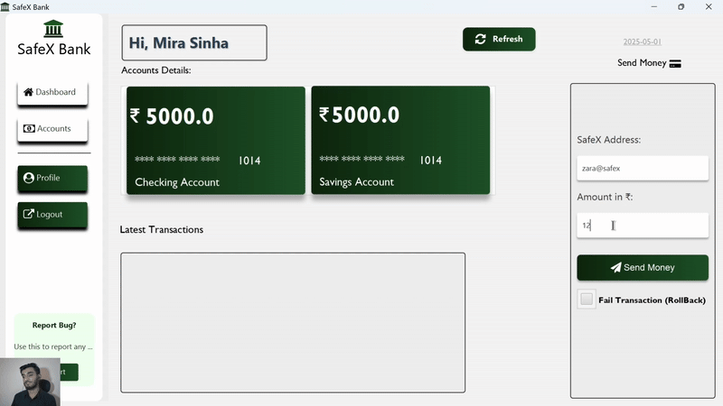

# PREVIEW

Small-Preview Of Application Important Features 
🚨 **Important Note:** <b>Turn On Audio</b> **🔊**


https://github.com/user-attachments/assets/7d8b0e0c-37b5-49dc-9bda-8ece1e4ef3cf

## 📽️ SafexBank Demo (Click to Play GIF)



SafexBank is a secure banking app built with Java and JavaFX.

# SafexBank

SafexBank is a banking application built with **Java** and **JavaFX**. The project allows users to send money, check balances, and perform transactions securely.

## 🚀 Features

- **Money Transfer**: Send money to other accounts.
- **Transaction History**: View your past transactions.
- **Account Balance**: Check available funds.
- **User Authentication**: Secure login and registration system.

## 🛠️ Technologies Used

- **Backend**: Java
- **Architecture**: MVVM (Model View View-Model)
- **Frontend**: JavaFX (for UI)
- **Database**: MySQL (or any other database you're using)
- **Build Tool**: Maven

## 💻 Prerequisites

Before you begin, ensure you have the following installed:

- **JDK 11+** (or higher) - Java Development Kit
- **Maven** - – Dependency management and build tool (used to manage JavaFX and FontAwesomeFX dependencies)
- **MySQL** - Or any other database you're using
- **Git** - For version control

## ⚡ Setup Instructions

### 1. Clone the repository
Clone the repository to your local machine:
```bash
git clone https://github.com/Kaif-Nazir/SafeXBank.git
cd SafeXBank
